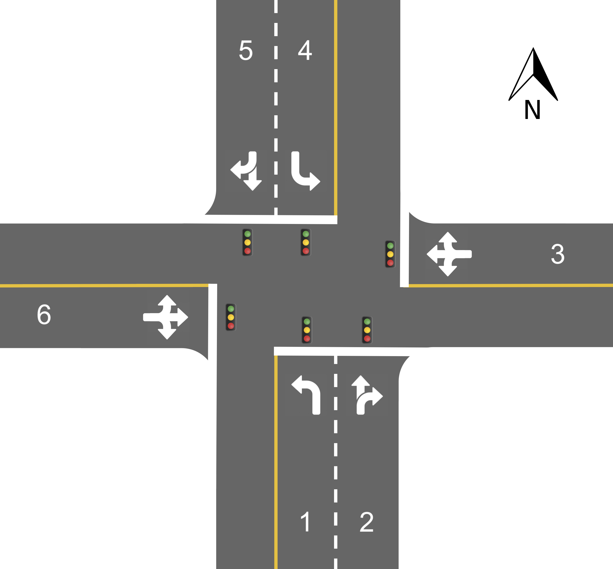
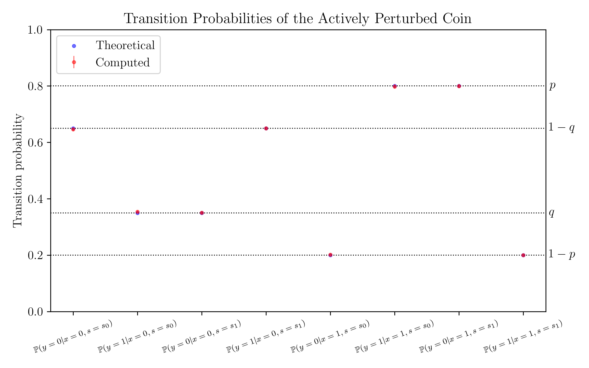
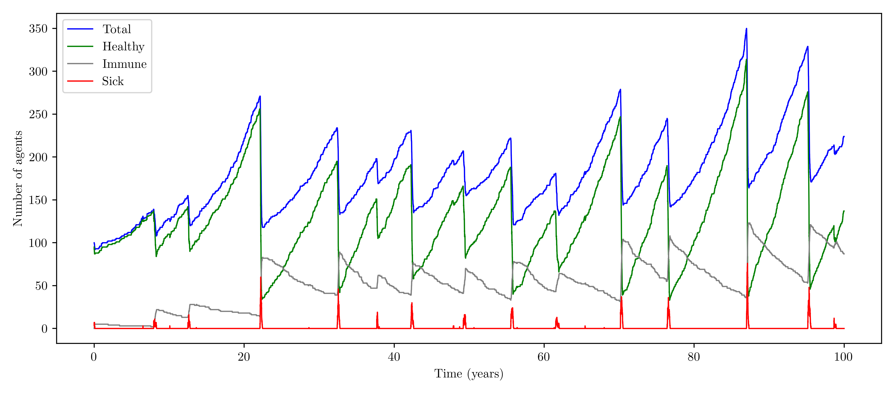
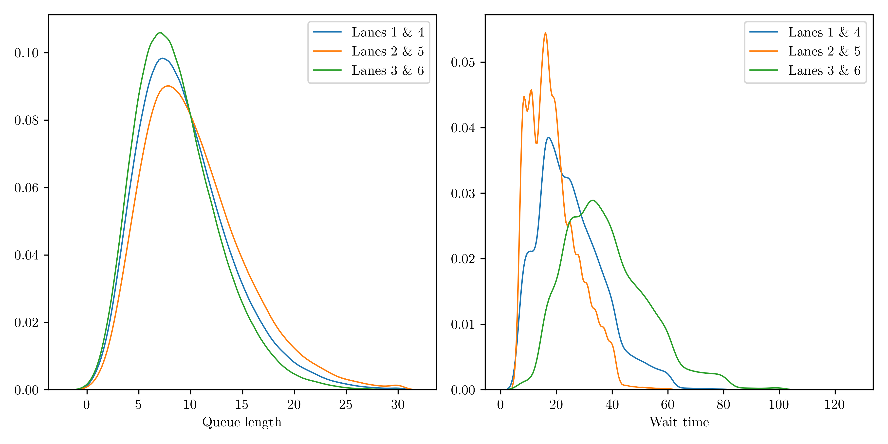

# Quantum Agent-Based Modeling (QABM)

This repository contains implementations of agent-based modelling simulations using the quantum agents proposed in [1].  Quantum agents exploit quantum mechanical phenomena to achieve superior entropic memory efficiency over their classical counterparts.

## Overview
The project implements three main quantum agent-based models:

1. **Actively Perturbed Coin**: A simple example described in [2] to illustrate the memory advantage provided by the quantum framework.  The agent represents a single coin with states 0 and 1, receiving a binary input $`x\in\{0,1\}`$ at each time step. In response, the agent flips the coin with probability $p$ if $x=1$ and with probability $q$ if $x=0$, where $`0 \lt p,q \lt 1`$. The agent then outputs the new state $`y\in\{0,1\}`$ of the coin.
2. **Viral Infection Model**: Simulates the spread and perpetuation of a viral infection (specifically, the Ebola virus) in a closed population with agents that can be in one of four states: sick, immune, healthy, or dead. The model is based on [this](http://www.netlogoweb.org/launch#http://www.netlogoweb.org/assets/modelslib/Sample%20Models/Biology/Virus.nlogo) model from [NetLogo](https://ccl.northwestern.edu/netlogo/) and includes mechanisms for infection spread, recovery, death, immunity loss, and reproduction.
3. **Traffic Intersection Model**: Simulates the six-lane traffic intersection of figure 1 with quantum-encoded lane agents and a classical traffic light control system. The model handles vehicle queuing, traffic light timing, and vehicle flow through the intersection.

  

  <em>Figure 1: Intersection configuration.</em>

## Features

- Quantum encoding of agent states using minimal memory requirements
- Hybrid quantum-classical approach for position-based simulations
- Efficient spatial querying using k-d trees for the viral infection model
- Probabilistic vehicle arrival and departure modeling for the traffic simulation
- Analysis tools for computing quantum and classical entropy metrics
- Visualization capabilities for simulation results

## Model Parameters

### Viral Infection Model
| Parameter | Description | Default Value |
| --------- | ----------- | ------------- | 
| $p_{recover}$ | Daily probability of recovery | 0.05 |
| $p_{die}$ | Daily probability of death for infected | 0.05 |
| $`p_{lose\_immunity}`$ | Daily probability of losing immunity | 0.00027 |
| $p_{infect}$ | Probability of infection on contact | 0.8 |
| $`p_{random\_infect}`$ | Daily probability of random infection | $`5.5\cdot 10 ^{-6}`$ |
| $p_{reproduce} | Daily probability of reproduction | 0.0003 |

## Results

Figure 2 shows the theoretical and computed transition probabilities for the actively perturbed coin, confirming that the quantum encoding accurately replicates the classical model.

  

  <em>Figure 2: Computed and theoretical transition probabilities for the actvely perturbed coin.</em>

Figure 3 shows the number of agents occupying each state throughout a 100-year simulation of the viral infection model. Outbreaks are clearly evident by the spikes in the population of sick agents and the corresponding drops in the number of healthy agents.

  

  <em>Figure 3: Agent counts through a 100-year simulation of the viral infection model.</em>

Figure 4 shows the distributions of queue length and wait times between green lights for a 250,000-light cycle simulation of the intersection model. Each lane accumulates a similar queue length between green lights, however, the lower vehicle arrival rates of lanes 3 and 6 lead to higher wait times.

  

  <em>Figure 4: KDE distributions of maximal queue length and wait times between green lights for each lane configuration.</em>

The implementation demonstrates significant memory compression for the traffic intersection model:
- 32.4% improvement for lanes 1 & 4
- 40.5% improvement for lanes 2 & 5
- 20.3% improvement for lanes 3 & 6

The viral infection model shows minimal quantum advantage (approximately 0.0015%) due to the near-orthogonality of its memory states.

## References

[1] Thomas J. Elliott, Mile Gu, Andrew J. P. Garner, and Jayne Thompson. Quantum Adaptive Agents with Efficient Long-Term Memories. Phys. Rev. X, 12:011007, Jan 2022.

[2] Jayne Thompson, Andrew J. P. Garner, Vlatko Vedral, and Mile Gu. Using Quantum Theory to Simplify Input–Output Processes. npj Quantum Information, 3(1):6, Feb 2017.