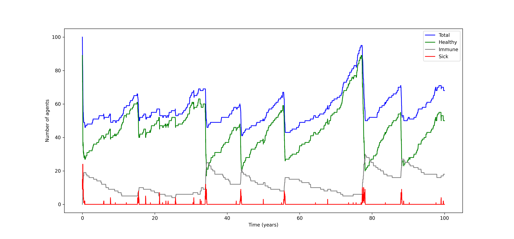

# Quantum Agents

This repository contains implementations of agent-based modelling simulations using quantum agents as described [here](https://arxiv.org/abs/2108.10876).  Quantum agents exploit quantum mechanical phenomena to achieve superior memory efficiency over their classical counterparts.

## Actively Perturbed Coin

In [actively_perturbed_coin.py](https://github.com/adamreidsmith/QuantumAgents/blob/master/actively_perturbed_coin.py), we present a simple example, an [actively perturbed coin](https://www.nature.com/articles/s41534-016-0001-3), to illustrate the memory advantage provided by the quantum framework. The agent represents a single coin with states 0 and 1, receiving a binary input $`x\in\{0,1\}`$ at each time step. In response, the agent flips the coin with probability $p$ if $x=1$ and with probability $q$ if $x=0$, where $`0 \lt p,q \lt 1`$. The agent then outputs the new state $`y\in\{0,1\}`$ of the coin.

## Viral Infection

In [viral_infection.py](viral_infection.py), we develop a viral infection model inspired by the NetLogo virus model found [here](http://www.netlogoweb.org/launch#http://www.netlogoweb.org/assets/modelslib/Sample%20Models/Biology/Virus.nlogo).  The agents interact in a closed environment to simulate the spread and perpetuation of the Ebola virus disease using parameters from the [2014 Ebola virus outbreak](https://en.wikipedia.org/wiki/Western_African_Ebola_virus_epidemic) in West Africa.  A classical ABM model was produced alongside the quantum model for comparison, and the two simulations were found to produce the same statistics.  A 100-year simulation was conducted and the health status of the population is shown in the plot below.

The entropy of the agents' memory system in the quantum simulation ($`Q_X=0.89 \pm 0.07`$) was found to be negligibly lower than in the classical case ($`C_X=0.92 \pm 0.06`$).  This is due to the magnitdues of the transition probabilities of the model.  Due to the nature of the Ebola virus, the simulation is not conducive to a high memory compression from the quantum model.  To achieve better memory compression, we may adjust the parameters defining the transition probabilities of the model.  This yields entropies of $`Q_X=1.320 \pm 0.002`$ and $`C_X=1.450 \pm 0.003`$ for the quantum and classical models, respectively, but no longer represents a realistic simulation of the Ebola virus.